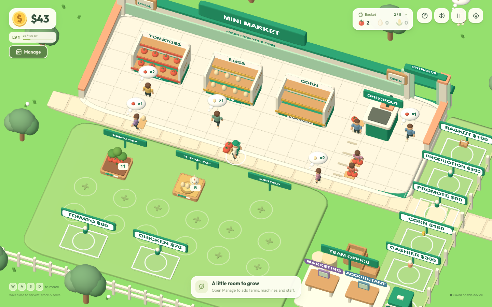

# Mini Market Manager

A small farm, a friendly market, and room to grow. Mini Market Manager is an original 3D browser management game: harvest fresh produce, fill your shelves, serve customers, and turn your first sales into a thriving little business.

[Play on GitHub Pages](https://barezbaban.github.io/mini-market-game/) · [Architecture](docs/architecture.md) · [Development and deployment](docs/development.md)

## Gameplay

Start with **$0**, a basket that holds **8 items**, a tomato patch, and a chicken area. Walk near ripe produce to collect it, carry it to the matching shelf, and wait at checkout to serve customers. All everyday interactions happen automatically when you are close enough.

Grow → harvest → process → carry → stock → serve → earn → upgrade.

The market occupies the top of the map; the farms and processing areas sit below it. Customers arrive from outside, walk through the labeled sliding entrance, find available products, form a checkout line, pay, return through the door, and continue off-screen before leaving the simulation. Open **Manage** to inspect and purchase upgrades, or stand on an affordable world pad for a little over a second. The management window pauses the simulation while you plan.

| Product       | Production                       | Sale price | Availability                |
| ------------- | -------------------------------- | ---------- | --------------------------- |
| Tomatoes      | 3 per plant / 3 seconds          | $5         | Available at the start      |
| Eggs          | 1 per nest / 4 seconds           | $7         | Available at the start      |
| Corn          | 2 per plot / 5 seconds           | $10        | Unlock for $150             |
| Tomato paste  | 1 tomato → 1 can; 6-second batch | $15        | Production wing and cannery |
| Coffee beans  | 2 per plant / 4 seconds          | $12        | Coffee corner               |
| Ground coffee | 1 bean → 1 bag; 8-second batch   | $24        | Coffee corner and grinder   |
| Carrots       | 1 per bed / 2 seconds            | $8         | Carrot garden               |

All seven shelves hold **12 items**. Add up to five tomato plants, nests, corn plots, and coffee plants; the carrot garden supports eight beds. Every plot has its own production timer. Machines process **up to** 2, 4, 6, or 8 ingredients per batch as they are upgraded, and start a smaller batch when less input is available. Stand near a machine while carrying its raw ingredient to supply it, then collect the finished products when your basket has room.

Expand eastward in three stages: **production wing ($250)**, **coffee corner ($500)**, and **carrot garden ($1,000)**. The management cards show current capacity, the next effect, the exact next price, and any prerequisite. Most repeated upgrades grow more expensive; the carrot-bed price increases by 20% each time.

Hire up to **three helpers** to harvest, operate machines, and stock shelves. Their baskets grow **2 → 3 → 4 → 5 → 6** items; ten speed levels multiply walking speed by **1.10** at each upgrade. A cashier has five levels, with checkout time divided by 1.25 at each level after hiring. A marketing director has ten levels, each adding 20% of the base customer arrival rate. An accountant has five levels and earns **5 XP per level every 10 seconds** while the market runs. Sales also award **5 XP**. The compact HUD shows your player level and progress toward the next level.

The **drive-through service** is available to purchase from the beginning. Cars and bikes arrive with visible lists of two to four items. Carry each requested product to the drive window one at a time, then remain there to collect payment. The drive-through runner and drive-through cashier are separate hires: the runner takes requested stock from shelves, while the cashier handles only completed payments.

## Features

- Original low-poly 3D world, rounded characters, produce models, and shop branding.
- Full-screen game presentation with clear lighting, no world shadows, and a compact HUD.
- Automatic harvesting, stocking, and checkout; no interaction button needed.
- Seven products, independently growing farm plots, and two processing machines.
- Customer state machines, a physical animated entrance, an orderly checkout queue, and a hireable cashier.
- Purchasable car-and-bike drive-through orders with separate runner and cashier automation.
- Three store expansions and management tabs for Store, Farms, Machines, and Staff.
- Upgradeable helpers, cashier, marketing director, and accountant; player XP and levels.
- Floating feedback, carried products, stock indicators, and a short first-time tutorial.
- Desktop movement and a virtual joystick for touch screens.
- Local saves, a sound toggle, and a confirmed reset in Settings.
- Modular TypeScript systems, automated tests, and GitHub Pages deployment.

## Controls

| Action              | Desktop                                                | Touch                              |
| ------------------- | ------------------------------------------------------ | ---------------------------------- |
| Move                | **WASD**, **arrow keys**, or drag the world            | Virtual joystick or drag the world |
| Harvest or stock    | Stand near a farm or matching shelf                    | Same                               |
| Serve checkout      | Stand beside the checkout counter                      | Same                               |
| Serve drive-through | Bring listed items to its window, then collect payment | Same                               |
| Buy an upgrade      | Open **Manage**, or hold on a world pad                | Same                               |
| See all inventory   | Open the **Basket** dropdown                           | Tap **Basket**                     |
| Sound               | Use the speaker button in the toolbar                  | Tap the speaker button             |
| Reset progress      | Open **Settings**                                      | Tap **Settings**                   |

The game fills the browser window. The camera and overlays adapt to desktop, tablet, phone landscape, and phone portrait. Touch movement does not scroll the page; drag an open part of the world to position a temporary joystick, or use the fixed touch joystick.

## Screenshots



The screenshots are captured from the running application. Scenery, characters, and produce are original 3D meshes created for this project.

[Mobile landscape screenshot](docs/screenshots/mobile-landscape.png) · [Mobile portrait screenshot](docs/screenshots/mobile-portrait.png)

[Expanded store](docs/screenshots/expanded-store.png) · [Management panel](docs/screenshots/management.png)

[Drive-through order](docs/screenshots/drive-through.png)

The expanded-store, management, and mobile-portrait captures use isolated demonstration fixtures with selected upgrades and currency, so new areas and controls can be shown. These fixtures do not represent progression earned during a play session or modify a player's saved market. The desktop capture advances an isolated gameplay session; mobile landscape shows a fresh market.

## Technology

TypeScript in strict mode, Vite, Three.js, WebGL2, HTML, CSS, and npm. ESLint and Prettier handle code quality; Vitest tests the core systems and Playwright exercises the browser experience. The game runs entirely in the browser and stores progress in `localStorage`.

The target browsers are current Chrome, Safari, Edge, and Firefox with WebGL2 available. Enable browser graphics acceleration if the game reports that 3D graphics are unavailable. Rendering targets 60 FPS with a maximum of 10 active customers; actual performance depends on the device and browser. The renderer and interface can change while the pure TypeScript game engine and versioned saves remain independent.

## Local development

Use **Node.js 22.17.1 or newer in the Node 22 release line** for the same runtime used during development. Vite requires Node 20.19+ in the Node 20 line, or Node 22.12+; CI uses Node 22.

### Installation

```sh
git clone https://github.com/barezbaban/mini-market-game.git
cd mini-market-game
npm install
```

For a reproducible install from the committed lockfile, use `npm ci`.

If installation reports `EACCES` or root-owned files in your npm cache, use a writable cache without changing system permissions:

```sh
npm install --cache /tmp/mini-market-game-npm-cache
```

The same `--cache` option works with `npm ci`. This handles the cache permission issue encountered on the development Mac; `sudo npm install` is unnecessary. See [installation troubleshooting](docs/development.md#npm-cache-permissions) for details.

### Development

```sh
npm run dev
```

Open the local URL printed by Vite, including `/mini-market-game/`. To play from a phone on the same trusted network, run `npm run dev -- --host 0.0.0.0` and open the computer's network address with the same port and path.

### Testing and quality checks

```sh
npm run lint
npm test
npm run build
```

`npm run test:watch` starts interactive unit testing. `npm run format` formats the project; `npm run format:check` checks formatting without changing files.

For browser tests, run `npm run build` and then `npm run preview`. Leave the preview running and, in a second terminal, run:

```sh
npm run test:e2e
```

The browser suite uses an installed Google Chrome by default and expects the production preview at `http://127.0.0.1:4173/mini-market-game/`. It does not start or rebuild the preview itself. [Browser testing instructions](docs/development.md#browser-tests) cover installing Playwright browsers, selecting Firefox or WebKit, and configuring a different browser channel or preview URL.

### Production build

```sh
npm run build
npm run preview
```

Vite emits the static site into `dist/`. Preview uses the same repository base path as production. See [development notes](docs/development.md) for debugging and a manual gameplay checklist.

## Deployment

The repository is configured for **GitHub Pages** at:

[https://barezbaban.github.io/mini-market-game/](https://barezbaban.github.io/mini-market-game/)

In the repository's **Settings → Pages**, select **GitHub Actions** as the build and deployment source. Every push to `main` then installs dependencies, runs lint and tests, builds the site, and publishes `dist/` using the official GitHub Pages actions. The workflow can also be started from the Actions tab. Pull requests run the build checks without publishing.

Vite's `base` is `/mini-market-game/`. If you rename the repository or use a custom domain, update `vite.config.ts` and the links in this README to match. The workflow does not require a manually maintained deployment branch or copying built files.

## Project structure

```text
.github/workflows/deploy.yml   # CI and Pages publication
public/                       # Static files copied into the build
assets/                       # Original artwork and replacement guidelines
src/
  main.ts                     # Application startup
  game/
    data/                     # Product, upgrade, and game configuration
    managers/                 # Audio and other shared presentation services
    rendering/                # Three.js renderer, original models, and world meshes
    systems/                  # Inventory, farms, machines, workers, progression, saves
    ui/                       # HUD, feedback, and touch input
    GameRuntime.ts            # Frame loop, input, lifecycle, and presentation events
    types.ts                  # Shared contracts
styles/                       # Responsive layout and interface styling
tests/                        # Core gameplay system tests
e2e/                          # Browser gameplay, persistence, layout, and touch tests
docs/                         # Architecture, development, and screenshots
```

Game rules live outside rendering. A storage interface separates game state from browser persistence, leaving a clear place for an API or cloud save implementation later. See [architecture and extension guidelines](docs/architecture.md).

## Configuration and original assets

- Change the working title and global timings in `src/game/data/gameConfig.ts`.
- Tune product names, growth times, prices, and shelf locations in `src/game/data/products.ts`.
- Tune upgrade descriptions, costs, and positions in `src/game/data/upgrades.ts`.
- Configure processing recipes, batch timings, and buffers in `src/game/data/machines.ts`.
- Keep new content in these definitions and reuse the shared systems. The [extension guide](docs/architecture.md) explains how to add products, workers, and persistent storage.

The world and characters are built from original procedural 3D meshes with shared geometry and materials. SVG icons support the HTML interface; small canvas textures provide readable world labels. Audio uses original procedural sounds, so no external model or sound pack is needed. The interface uses optional Google Fonts with system-font fallbacks. Third-party fonts and libraries retain their respective licenses. See [asset credits](docs/credits.md).

## Roadmap

### Phase 2 — A busier neighborhood market

Additional recipes; a storage room; multiple checkout counters; richer customer patience; daily objectives and achievements.

### Phase 3 — A growing business

Multiple supermarket locations; cosmetic customization; store analytics; opt-in accounts and cloud saves; leaderboards.

### Phase 4 — More ways to play

An installable PWA; Android and iOS packaging; a backend where needed; optional social or multiplayer features.

These are future possibilities, not features required to run the current game.

## License

Project code and original assets are available under the [MIT License](LICENSE).
